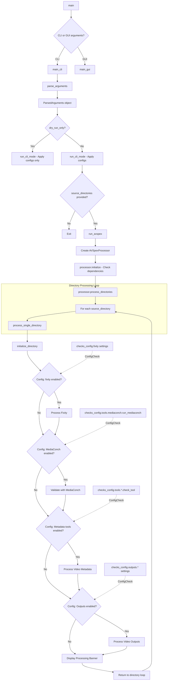
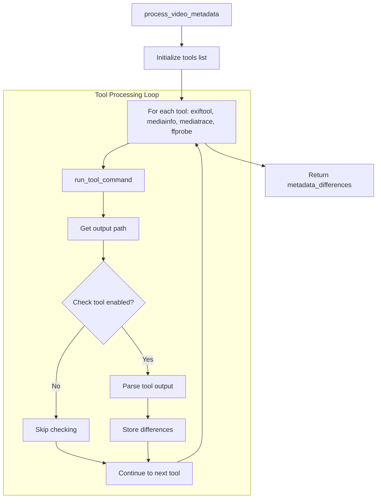
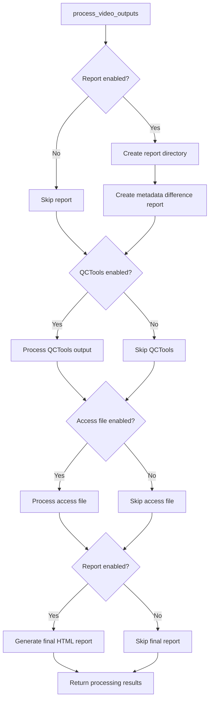

# AV Spex CLI Developer Documentation

## Overview

The AV Spex CLI application's control flow primarily follows a 'for loop' which processes input directories according to settings stored in the Checks config and Spex config:   



This document describes the control flow of the AV Spex application in CLI mode, from command-line argument processing through execution of the video processing pipeline.

The CLI implementation follows a modular architecture with clear separation of concerns:

1. Entry point (`av_spex_the_file.py`) - Parses command-line arguments and initiates processing
2. Processor (`avspex_processor.py`) - Orchestrates the processing workflow
3. Process Management (`processing_mgmt.py`) - Manages the execution of processing steps
4. Tool Running (`run_tools.py`) - Handles execution of individual metadata tools
5. Parsing Tool-specific Outputs(`AVSpex.checks`) - Various scripts for parsing metadata tool output

## Entry Point: av_spex_the_file.py

The main entry point to the CLI application is `av_spex_the_file.py`, which initializes the application, parses command-line arguments, and triggers the processing workflow.

### Initialization Sequence

```python
def main():
    args = parse_arguments()

    if args.gui or (args.source_directories is None and not sys.argv[1:]):
        main_gui()
    else:
        main_cli()
````

* If `--gui` is passed, the application launches in GUI mode.
* Otherwise, it proceeds in CLI mode, updating configuration settings and running processing.

```python
def main_cli():
    args = parse_arguments()

    if args.gui:
        main_gui()
    else:
        run_cli_mode(args)
        if args.source_directories:
            run_avspex(args.source_directories)
```

### Command-Line Argument Processing

The application uses Python's `argparse` module to define and parse command-line arguments. These are parsed and assembled into a `ParsedArguments` dataclass.

```python
@dataclass
class ParsedArguments:
    source_directories: List[str]
    selected_profile: Optional[Any]
    sn_config_changes: Optional[Any]
    fn_config_changes: Optional[Any]
    print_config_profile: Optional[str]
    dry_run_only: bool
    tools_on_names: List[str]
    tools_off_names: List[str]
    gui: Optional[Any]
    export_config: Optional[str]
    export_file: Optional[str] 
    import_config: Optional[str]
    mediaconch_policy: Optional[str]
    use_default_config: bool
```

Examples of supported CLI flags:

* `--profile`: applies a predefined processing profile
* `--on` / `--off`: selectively toggle individual tools
* `--signalflow` / `--filename`: apply specialized configuration structures
* `--export-config` / `--import-config`: serialize and load JSON-based configurations
* `--dryrun`: skip processing and apply config changes only
* `--printprofile`: print selected config values for review

The parsed values are passed downstream as a `ParsedArguments` instance.

### Configuration Application

Before starting the processing, any command-line configuration changes are applied to the configs via the `ConfigManager`.
The application can also export or import configuration files, and reset saved user configurations.

```python
def run_cli_mode(args):
    print_av_spex_logo()

    cli_deps_check()

    if args.selected_profile:
        config_edit.apply_profile(args.selected_profile)
        config_mgr.save_config('checks', is_last_used=True)

    if args.tools_on_names:
        config_edit.toggle_on(args.tools_on_names)
        config_mgr.save_config('checks', is_last_used=True)

    if args.tools_off_names:
        config_edit.toggle_off(args.tools_off_names)
        config_mgr.save_config('checks', is_last_used=True)

    if args.mediaconch_policy:
        processing_mgmt.setup_mediaconch_policy(args.mediaconch_policy)

    if args.sn_config_changes:
        config_edit.apply_signalflow_profile(args.sn_config_changes)

    if args.fn_config_changes:
        filename_profile = args.fn_config_changes
        config_edit.apply_filename_profile(filename_profile)
        config_mgr.save_config('spex', is_last_used=True)

    if args.export_config:
        config_types = ['spex', 'checks'] if args.export_config == 'all' else [args.export_config]
        config_io = ConfigIO(config_mgr)
        filename = config_io.save_configs(args.export_file, config_types)
        print(f"Configs exported to: {filename}")
        if args.dry_run_only:
            sys.exit(0)

    if args.import_config:
        config_io = ConfigIO(config_mgr)
        config_io.import_configs(args.import_config)
        print(f"Configs imported from: {args.import_config}")

    if args.print_config_profile:
        config_edit.print_config(args.print_config_profile)

    if args.dry_run_only:
        logger.critical("Dry run selected. Exiting now.")
        sys.exit(1)
```

This function performs the following:

* Verifies external dependencies
* Updates and persists configuration changes
* Handles config import/export
* Optionally skips processing if `--dryrun` is used

### Processing Initiation

The `run_avspex()` function acts as the bridge between the command-line interface and the core processing logic:

```python
def run_avspex(source_directories, signals=None):
    processor = AVSpexProcessor(signals=signals)
    try:
        formatted_time = processor.process_directories(source_directories)
        return True
    except Exception as e:
        print(f"Error: {str(e)}")
        sys.exit(1)
```

This function:

* Creates an instance of the `AVSpexProcessor` class
* Runs the `process_directories()` method
* Exits with an error if processing fails


## The ProcessingManager Class

The `ProcessingManager` class in `processing_mgmt.py` is responsible for executing the individual processing steps delegated by the `AVSpexProcessor`.

While `AVSpexProcessor` handles input flow, signal routing, and configuration loading, `ProcessingManager` performs the actual **execution** logic for fixity checks, tool runs, and output creation.

The class is initialized per directory and maintains no persistent state across runs.

```python
processing_mgmt = ProcessingManager(signals=self.signals, check_cancelled_fn=self.check_cancelled)
```

It accepts:

* A `signals` object (optional, used to emit updates in GUI mode)
* A `check_cancelled_fn` callback (used to cooperatively halt execution)

---

### Responsibilities

`ProcessingManager` calls specific submodules to process individual directories. Its key responsibilities include:

#### 1. Fixity Processing

```python
def process_fixity(self, source_directory, video_path, video_id):
    ...
```

* Creates "whole file" and "stream hash" checksums
* Verifies against stored checksums if configured
* Uses modules like `embed_fixity.py`, `fixity_check.py`

#### 2. MediaConch Validation

```python
def validate_video_with_mediaconch(self, video_path, dest_dir, video_id):
    ...
```

* Runs MediaConch using a policy file defined in the config
* Parses output and emits GUI progress signals (if present)

#### 3. Metadata Tool Execution

```python
def process_video_metadata(self, video_path, destination_directory, video_id):
    ...
```

* Runs tools like `mediainfo`, `mediatrace`, `exiftool`, and `ffprobe`
* Each tool's output is parsed via a corresponding function in `AV_Spex.checks.*`
* Returns a dictionary of metadata differences (used for reporting)

#### 4. Output Creation

```python
def process_video_outputs(self, video_path, source_directory, destination_directory, video_id, metadata_differences):
    ...
```

* Generates:

  * HTML reports
  * Access copies
  * QCTools graphs and analysis
* Steps are enabled individually via config options

---

### Coordination with AVSpexProcessor

The `AVSpexProcessor` delegates all file-level work to `ProcessingManager`, maintaining a clean separation of duties:

| Task                         | Owner               |
| ---------------------------- | ------------------- |
| Multi-directory processing loop      | `AVSpexProcessor`   |
| Directory iteration and validation | `AVSpexProcessor`   |
| Overall timing and completion logging | `AVSpexProcessor`   |
| Run tools and parse output   | `ProcessingManager` |
| Generate outputs             | `ProcessingManager` |

This structure supports:

* GUI responsiveness via `signals`
* Reuse of `ProcessingManager` methods in other entry points
* Easier unit testing of isolated processing logic

---

* `AVSpexProcessor` is the high-level workflow controller.
* `ProcessingManager` is the low-level executor of tools and tasks.
* Together they modularize CLI behavior, separate concerns, and allow flexible reuse in GUI and headless workflows.


## Directory Processing

Once initialized, processing begins with:

```python
def process_directories(self, source_directories):
    if self.check_cancelled():
        return False

    overall_start_time = time.time()
    total_dirs = len(source_directories)

    for idx, source_directory in enumerate(source_directories, 1):
        if self.check_cancelled():
            return False

        if self.signals:
            self.signals.file_started.emit(source_directory, idx, total_dirs)

        source_directory = os.path.normpath(source_directory)
        self.process_single_directory(source_directory)

    overall_end_time = time.time()
    formatted_time = log_overall_time(overall_start_time, overall_end_time)

    if self.signals:
        self.signals.step_completed.emit("All Processing")

    return formatted_time
```

This method:

* Records the overall start time
* Iterates through each source directory:

  * Checks for cancellation before processing each one
  * Emits a `file_started` signal with current progress (if GUI-connected)
  * Normalizes the directory path
  * Passes the directory to `process_single_directory()`
* After processing all directories:

  * Records the overall end time
  * Logs the total processing duration
  * Emits a final `step_completed` signal

If cancellation occurs at any point, the method returns early with `False`.

## Processing Steps

1. **Directory Initialization**
   ```python
   init_dir_result = dir_setup.initialize_directory(source_directory)
   if init_dir_result is None:
       return False
   video_path, video_id, destination_directory, access_file_found = init_dir_result
    ```

* Validates and prepares the input directory for processing.
* Extracts the absolute path to the input video, the derived `video_id`, the target destination directory, and whether an access file already exists.
* The `video_id` (typically the filename without extension) is used for log banners, file naming, and output report generation.
* Returns `False` if the directory is invalid or cannot be prepared (e.g., missing expected video file).

2. **Processing Manager Setup**

   ```python
   processing_mgmt = ProcessingManager(signals=self.signals, check_cancelled_fn=self.check_cancelled)
   ```

   * Instantiates a `ProcessingManager` to handle all file-level processing tasks for the current directory.
   * The `signals` parameter is passed from `AVSpexProcessor`, allowing `ProcessingManager` to emit GUI updates during each step if applicable.
   * The `check_cancelled_fn` allows `ProcessingManager` to poll for cancellation requests during long-running subprocess calls.
   * While `AVSpexProcessor` controls the high-level flow and state, `ProcessingManager` handles the tool-specific execution logic, including fixity checking, metadata analysis, and output generation.

3. **Checks – Fixity Processing**

If any fixity-related options are enabled in the Checks Config, the `AVSpexProcessor` initiates fixity processing through the `ProcessingManager`. These options include:

- `check_fixity`
- `validate_stream_fixity`
- `embed_stream_fixity`
- `output_fixity`

#### AVSpexProcessor

```python
fixity_enabled = False
fixity_config = self.checks_config.fixity

if (fixity_config.check_fixity == "yes" or 
    fixity_config.validate_stream_fixity == "yes" or 
    fixity_config.embed_stream_fixity == "yes" or 
    fixity_config.output_fixity == "yes"):
    fixity_enabled = True

if fixity_enabled:
    processing_mgmt.process_fixity(source_directory, video_path, video_id)
```

* Detects whether any fixity operation is configured
* If so, delegates execution to `ProcessingManager.process_fixity()`

---

#### ProcessingManager

```python
def process_fixity(self, source_directory, video_path, video_id):
    if self.check_cancelled():
        return None

    if checks_config.fixity.embed_stream_fixity == 'yes':
        process_embedded_fixity(video_path)

    if checks_config.fixity.validate_stream_fixity == 'yes':
        if checks_config.fixity.embed_stream_fixity == 'yes':
            logger.critical("Embed stream fixity is turned on, which overrides validate_fixity. Skipping validate_fixity.\n")
        else:
            validate_embedded_md5(video_path)

    md5_checksum = None
    if checks_config.fixity.output_fixity == 'yes':
        md5_checksum = output_fixity(source_directory, video_path)

    if checks_config.fixity.check_fixity == 'yes':
        check_fixity(source_directory, video_id, actual_checksum=md5_checksum)
```

This code orchestrates four distinct operations (depending on the config):

* **`embed_stream_fixity`**

  * Runs `process_embedded_fixity()` to calculate and embed MD5 stream hashes into MKV XML tags.
  * Uses `ffmpeg`, `mkvextract`, and `mkvpropedit`.

* **`validate_stream_fixity`**

  * Extracts hashes from existing MKV tags and compares them against freshly calculated ones.
  * If tags are missing, it falls back to `embed_fixity()`.

* **`output_fixity`**

  * Generates a file-level MD5 checksum and writes the result to both `.txt` and `.md5` output files.
  * Uses a modified version of `hashlib_md5()` from IFIscripts.

* **`check_fixity`**

  * Searches for past checksum files in the directory.
  * Compares historical checksums against current values.
  * Logs result to a fixity report file.

Each function uses cooperative cancellation checks and emits progress either via GUI signals or console output.

4. **Checks – MediaConch Validation**

The MediaConch check is triggered if it is enabled in the Checks Config:

```python
mediaconch_enabled = self.checks_config.tools.mediaconch.run_mediaconch == "yes"
if mediaconch_enabled:
    mediaconch_results = processing_mgmt.validate_video_with_mediaconch(
        video_path, destination_directory, video_id
    )
```

MediaConch differs from the other tools in that it:

* Requires an external XML-based policy file
* Produces structured CSV output
* Involves additional parsing logic to determine pass/fail results

For this reason, MediaConch logic is separated from the generic metadata checks and handled in a dedicated step.

---

#### `ProcessingManager.validate_video_with_mediaconch()`

This function internally:

1. Retrieves the policy file from the config:

   ```python
   policy_path = find_mediaconch_policy()
   ```

2. Constructs and runs the MediaConch CLI command:

   ```python
   run_mediaconch_command(
       command="mediaconch -p", 
       input_path=video_path,
       output_type="-oc",  # CSV output
       output_path=output_file_path,
       policy_path=policy_path
   )
   ```

3. Parses the output:

   ```python
   results = parse_mediaconch_output(output_file_path)
   ```

Each step includes error handling and cancellation checks, and will emit a critical log message if validation fails.

---

#### Example Output Parsing

The CSV output is parsed into a dictionary of results:

```python
def parse_mediaconch_output(output_path):
    ...
    for mc_field, mc_value in zip(mc_header, mc_values):
        validation_results[mc_field] = mc_value
        if mc_value == "fail":
            logger.critical(f"{mc_field}: {mc_value}")
```

* Each row maps a policy check to a `"pass"` or `"fail"` result
* Failures are logged immediately and prominently
* If no failures are found, a success message is logged

---

#### MediaConch Summary

| Task                     | Function                                                  |
| ------------------------ | --------------------------------------------------------- |
| Load policy config       | `find_mediaconch_policy()`                                |
| Run validation command   | `run_mediaconch_command()`                                |
| Parse and report results | `parse_mediaconch_output()`                               |
| Entry point (per file)   | `validate_video_with_mediaconch()` in `ProcessingManager` |

5. **Checks – Metadata Tool Processing**

This stage runs a set of command-line tools—`exiftool`, `mediainfo`, `mediatrace`, and `ffprobe`—to extract technical metadata from the input video file. Each tool produces a sidecar output file (e.g., `.json`, `.xml`, or `.txt`) which is parsed and validated against expectations defined in the Spex Config.

Each tool must be explicitly enabled in the Checks Config (`checks_config.tools`) using its `run_tool` and `check_tool` flags.

```python
metadata_tools_enabled = False
tools_config = self.checks_config.tools

if (hasattr(tools_config.mediainfo, 'check_tool') and tools_config.mediainfo.check_tool == "yes" or
    hasattr(tools_config.mediatrace, 'check_tool') and tools_config.mediatrace.check_tool == "yes" or
    hasattr(tools_config.exiftool, 'check_tool') and tools_config.exiftool.check_tool == "yes" or
    hasattr(tools_config.ffprobe, 'check_tool') and tools_config.ffprobe.check_tool == "yes"):
    metadata_tools_enabled = True

metadata_differences = None
if metadata_tools_enabled:
    metadata_differences = processing_mgmt.process_video_metadata(
        video_path, destination_directory, video_id
    )
```

---

### Metadata Tool Workflow Diagram



---

### Tool Execution

Each tool is executed via `run_tool_command()`, which assembles the appropriate shell command and captures the output into a file:

```python
run_tool_command(tool_name, video_path, destination_directory, video_id)
```

Supported tools and their output formats:

| Tool         | Command Preview                      | Output Format |
| ------------ | ------------------------------------ | ------------- |
| `exiftool`   | `exiftool -j`                        | `.json`       |
| `mediainfo`  | `mediainfo -f --Output=JSON`         | `.json`       |
| `mediatrace` | `mediainfo --Details=1 --Output=XML` | `.xml`        |
| `ffprobe`    | `ffprobe ... -print_format json`     | `.txt`        |

---

### Parsing and Validation

Each tool's output is parsed and validated by a tool-specific function, located in `AV_Spex.checks`. Parsing is only performed if the tool’s `check_tool` flag is set to `"yes"`.

```python
from AV_Spex.checks.exiftool_check import parse_exiftool
from AV_Spex.checks.ffprobe_check import parse_ffprobe
from AV_Spex.checks.mediainfo_check import parse_mediainfo
from AV_Spex.checks.mediatrace_check import parse_mediatrace

def check_tool_metadata(tool_name, output_path):
    ...
```

These parsers:

* Normalize actual values using `str()` and `.strip()`
* Coerce expected values (from Spex config) into lists to allow multiple valid options
* Compare parsed output to expected values
* Log mismatches with both the actual and expected value
* Return a dictionary of differences, which is passed upstream to influence later output processing

---

### Spex Configuration Reference

Each parser draws expected values from the Spex config:

| Tool        | Spex Source                                                |
| ----------- | ---------------------------------------------------------- |
| `exiftool`  | `spex_config.exiftool_values` (dataclass `ExiftoolValues`) |
| `mediainfo` | `spex_config.mediainfo_values` (dict of dataclasses)       |
| `ffprobe`   | `spex_config.ffmpeg_values` (nested dict)                  |

The Checks Config (`checks_config`) controls whether a tool runs, but the Spex config defines what to expect.

---

### Tool-Specific Highlights

#### ExifTool

* JSON output is parsed and flattened into a dictionary.
* Values are compared to those defined in the `ExiftoolValues` dataclass.
* Supports both single expected values and lists of valid options.

#### FFprobe

* Parses nested dictionaries for `streams[0]` (video), `streams[1]` (audio), and `format` (contrainer/wrapper).
* Handles missing keys (`"metadata field not found"`) and empty fields (`"no metadata value found"`).
* Checks for specific embedded tags such as `ENCODER_SETTINGS`.
* Logs differences using field-specific exceptions to improve readability.

---

#### Metadata Tool Processing Summary

| Stage                      | Purpose                                                  |
| -------------------------- | -------------------------------------------------------- |
| `run_tool_command()`       | Executes configured CLI tool                             |
| `check_tool_metadata()`    | Delegates parsing based on tool name                     |
| `parse_*` functions        | Extract, normalize, and compare output                   |
| `process_video_metadata()` | Coordinates full metadata workflow, collects differences |

This modular structure supports flexible validation of media metadata across tools and formats while keeping parsing logic isolated and reusable.

6. **Output Generation**

After metadata checks are complete, the application can optionally generate additional output files depending on which tools and features are enabled in the Checks Config.

```python
outputs_enabled = (
    self.checks_config.outputs.access_file == "yes" or
    self.checks_config.outputs.report == "yes" or
    self.checks_config.tools.qctools.run_tool == "yes" or
    self.checks_config.tools.qct_parse.run_tool == "yes"
)

if outputs_enabled:
    processing_results = processing_mgmt.process_video_outputs(
        video_path, source_directory, destination_directory,
        video_id, metadata_differences
    )
```

---

### Output Workflow Overview



---

### Output Steps

1. **Report Directory & Metadata Differences**

   * If metadata difference reporting is enabled, a CSV is created.
   * Differences from `exiftool`, `mediainfo`, `mediatrace`, and `ffprobe` are written to `videoid_metadata_difference.csv`.

   ```python
   create_metadata_difference_report(metadata_differences, report_directory, video_id)
   ```

2. **QCTools Output**

   * If enabled, QCTools XML and visual artifacts (like graphs or thumbnails) are processed.
   * This may include `qct-parse` results and summary images, stored in the report directory.

3. **Access File Generation**

   * If enabled, a low-resolution `.mp4` access copy is created using `ffmpeg`.
   * Access file creation includes a cancel-aware progress monitor.

   ```python
   make_access_file(video_path, output_path, check_cancelled=..., signals=...)
   ```

   * Avoids duplicate generation by checking for existing `.mp4` files in the source directory.

4. **HTML Report Generation**

   * If the `report` option is enabled, an HTML file is generated to summarize:

     * Metadata differences
     * MediaConch results
     * Stream hashes
     * Fixity reports
     * QCTools thumbnails and frame evaluations
   * HTML content is assembled based on what exists in the report directory.

   ```python
   generate_final_report(video_id, source_directory, report_directory, destination_directory)
   ```

---

### Supporting Functions for Outputs

* `write_to_csv()` and `create_metadata_difference_report()` handle CSV logging for tool mismatches.
* `make_access_file()` wraps `ffmpeg` subprocess execution and tracks percent completion.
* `write_html_report()` builds the full HTML report from gathered outputs and analysis files.
* All outputs are cancel-aware and emit GUI signals where applicable.

---

### Outputs Summary

| Output Type            | Enabled by                    | File(s) Created              |
| ---------------------- | ----------------------------- | ---------------------------- |
| Metadata Differences   | `checks_config.outputs.report`              | `*_metadata_difference.csv`  |
| QCTools XML/Thumbnails | `checks_config.tools.qctools` / `qct_parse` | `.xml`, `.jpg`, `.png`, etc. |
| Access Copy            | `checks_config.outputs.access_file`         | `*_access.mp4`               |
| Final HTML Report      | `checks_config,outputs.report`              | `*_avspex_report.html`       |

All outputs are conditional. If all selected outputs succeed, a results dictionary is returned from `process_video_outputs()`.

7. **Completion**
    Upon completion of the single directory loop, the CLI app outputs the video ID in ASCII art, and, if additional source directories were provided, begins the loop again.