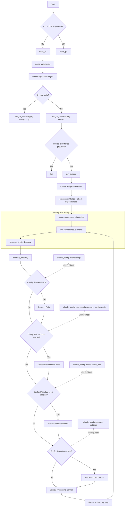
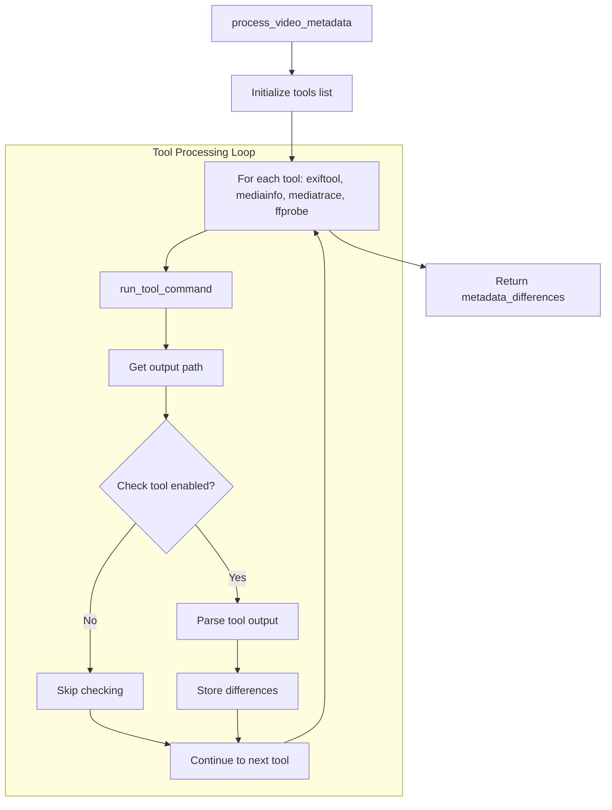
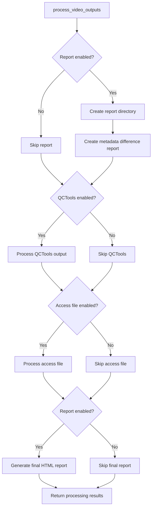

# AV Spex CLI Developer Documentation

## Overview

The AV Spex CLI application's control flow primarily follows a 'for loop' which processes input directories according to settings stored in the Checks config and Spex config:   


```mermaid
flowchart TD
    A[main] --> B{CLI or GUI arguments?}
    B -->|CLI| C[main_cli]
    B -->|GUI| D[main_gui]
    
    C --> E[parse_arguments]
    E --> F[ParsedArguments object]
    
    F --> G{dry_run_only?}
    G -->|Yes| H[run_cli_mode - Apply configs only]
    G -->|No| I[run_cli_mode - Apply configs]
    
    I --> J{source_directories provided?}
    J -->|No| K[Exit]
    J -->|Yes| L[run_avspex]
    
    L --> M[Create AVSpexProcessor]
    M --> N[processor.initialize - Check dependencies]
    N --> O[processor.process_directories]
    
    subgraph "Directory Processing Loop"
    O --> P[For each source_directory]
    P --> Q[process_single_directory]
    end
    
    Q --> R[initialize_directory]
    
    R --> S{Config: fixity enabled?}
    T[checks_config.fixity settings] -.->|ConfigCheck| S
    
    S -->|Yes| U[Process Fixity]
    S -->|No| V{Config: MediaConch enabled?}
    U --> V
    
    W[checks_config.tools.mediaconch.run_mediaconch] -.->|ConfigCheck| V
    V -->|Yes| X[Validate with MediaConch]
    V -->|No| Y{Config: Metadata tools enabled?}
    X --> Y
    
    Z[checks_config.tools.*.check_tool] -.->|ConfigCheck| Y
    Y -->|Yes| AA[Process Video Metadata]
    Y -->|No| AB{Config: Outputs enabled?}
    AA --> AB
    
    AC[checks_config.outputs.* settings] -.->|ConfigCheck| AB
    AB -->|Yes| AD[Process Video Outputs]
    AB -->|No| AE[Display Processing Banner]
    AD --> AE
    
    AE --> AF[Return to directory loop]
    AF --> P
```

This document describes the control flow of the AV Spex application in CLI mode, from command-line argument processing through execution of the video processing pipeline.

The CLI implementation follows a modular architecture with clear separation of concerns:

1. Entry point (`av_spex_the_file.py`) - Parses command-line arguments and initiates processing
2. Processor (`avspex_processor.py`) - Orchestrates the processing workflow
3. Process Management (`processing_mgmt.py`) - Manages the execution of processing steps
4. Tool Running (`run_tools.py`) - Handles execution of individual metadata tools
5. Parsing Tool-specific Outputs(`AVSpex.checks`) - Various scripts for parsing metadata tool output

## Entry Point: av_spex_the_file.py

The main entry point to the CLI application is `av_spex_the_file.py`, which initializes the application, parses command-line arguments, and triggers the processing workflow.

### Initialization Sequence

```python
def main():
    args = parse_arguments()

    if args.gui or (args.source_directories is None and not sys.argv[1:]):
        main_gui()
    else:
        main_cli()
````

* If `--gui` is passed, the application launches in GUI mode.
* Otherwise, it proceeds in CLI mode, updating configuration settings and running processing.

```python
def main_cli():
    args = parse_arguments()

    if args.gui:
        main_gui()
    else:
        run_cli_mode(args)
        if args.source_directories:
            run_avspex(args.source_directories)
```

### Command-Line Argument Processing

The application uses Python's `argparse` module to define and parse command-line arguments. These are parsed and assembled into a `ParsedArguments` dataclass.

```python
@dataclass
class ParsedArguments:
    source_directories: List[str]
    selected_profile: Optional[Any]
    sn_config_changes: Optional[Any]
    fn_config_changes: Optional[Any]
    print_config_profile: Optional[str]
    dry_run_only: bool
    tools_on_names: List[str]
    tools_off_names: List[str]
    gui: Optional[Any]
    export_config: Optional[str]
    export_file: Optional[str]
    import_config: Optional[str]
    mediaconch_policy: Optional[str]
    use_default_config: bool
    # Frame analysis sub-step toggles
    enable_bitplane_check: Optional[str]
    enable_border_detection: Optional[str]
    enable_brng_analysis: Optional[str]
    enable_signalstats: Optional[str]
    enable_dropped_sample_detection: Optional[str]
    enable_duplicate_frame_detection: Optional[str]
    # Frame analysis tuning
    frame_borders: Optional[str]
    frame_border_pixels: Optional[int]
    frame_no_colorbar_skip: bool
    frame_brng_duration: Optional[int]
    # qct-parse / CLAMS feature toggles
    enable_clamped_levels: Optional[str]
    enable_clams_detection: Optional[str]
    enable_audio_analysis: Optional[str]
    # Access file sub-options
    access_trim_color_bars: Optional[str]
    access_crop_borders: Optional[str]
    access_crop_to_480: Optional[str]
    # Output / fixity settings
    qctools_ext: Optional[str]
    checksum_algorithm: Optional[str]
    stream_hash_algorithm: Optional[str]
    # Apply named expected-value profiles to spex config
    exiftool_profile: Optional[str]
    mediainfo_profile: Optional[str]
    ffprobe_profile: Optional[str]
    # Import a new expected-value profile from a tool-output file (saves & applies)
    exiftool_from_file: Optional[str]
    mediainfo_from_file: Optional[str]
    ffprobe_from_file: Optional[str]
```

Argparse organizes flags into named groups so `av-spex --help` reads as a navigable reference: *Config profiles*, *Config import/export*, *Tool toggles*, *qct-parse / CLAMS*, *Frame analysis*, *Output settings*, *Fixity*. Group definitions live near the top of `parse_arguments()`; adding a new flag means picking the right `add_argument_group` to attach it to.

Examples of supported CLI flags:

* `--profile`: applies a predefined processing profile (`step1`, `step2`, or `off`)
* `--on` / `--off`: selectively toggle individual tools (e.g. `mediainfo.run_tool`, `clams_detection.run_tool`, `qct_parse.detect_clamped_levels`)
* `--signalflow` / `--filename`: apply specialized configuration structures by profile name
* `--exiftool-profile` / `--mediainfo-profile` / `--ffprobe-profile`: apply named expected-value profiles for metadata tools
* `--exiftool-from-file` / `--mediainfo-from-file` / `--ffprobe-from-file`: import a new expected-value profile from a raw tool-output file (saves the profile and applies it)
* `--export-config` / `--import-config`: serialize and load JSON-based configurations
* `--dryrun`: skip processing and apply config changes only
* `--printprofile`: print selected config values for review (e.g. `-pp checks,outputs` to see all frame_analysis fields)
* `--enable-bitplane-check` / `--enable-border-detection` / `--enable-brng-analysis` / `--enable-signalstats` / `--enable-dropped-sample-detection` / `--enable-duplicate-frame-detection`: toggle individual frame analysis sub-steps on or off
* `--frame-borders`: set border detection mode (`simple` or `sophisticated`)
* `--frame-border-pixels`: set pixel crop width for simple border mode
* `--frame-brng-duration`: set max duration (in seconds) for BRNG analysis
* `--frame-no-colorbar-skip`: disable automatic color bar skipping in frame analysis
* `--enable-audio-analysis`: toggle qct-parse audio analysis (clipping / channel imbalance / audible-timecode / dropout). Auto-enables `qct_parse.run_tool` if currently off.
* `--enable-clamped-levels`: toggle qct-parse's broadcast-range level-clamping detector. Auto-enables `qct_parse.run_tool` if currently off. Writes to `tools.qct_parse.detect_clamped_levels`, **not** `outputs.frame_analysis`.
* `--enable-clams-detection`: toggle CLAMS detection (SSIM bars + cross-correlation tone). Writes to `tools.clams_detection.run_tool`. Independent of qct-parse.
* `--access-trim-color-bars` / `--access-crop-borders` / `--access-crop-to-480`: access-file sub-options. `crop-borders` requires `crop-to-480`; the CLI enforces this with a warning.
* `--qctools-ext`: choose `qctools.xml.gz` or `qctools.mkv` for QCTools output
* `--checksum-algorithm` / `--stream-hash-algorithm`: choose `md5` or `sha256` for whole-file vs embedded-stream fixity

The parsed values are passed downstream as a `ParsedArguments` instance.

### Configuration Application

Before starting the processing, any command-line configuration changes are applied to the configs via the `ConfigManager`.
The application can also export or import configuration files, and reset saved user configurations.

```python
def run_cli_mode(args):
    print_av_spex_logo()

    cli_deps_check()

    # Checks config: profile, tool toggles
    if args.selected_profile:
        config_edit.apply_profile(args.selected_profile)
        config_mgr.save_config('checks', is_last_used=True)
    if args.tools_on_names:
        config_edit.toggle_on(args.tools_on_names)
        config_mgr.save_config('checks', is_last_used=True)
    if args.tools_off_names:
        config_edit.toggle_off(args.tools_off_names)
        config_mgr.save_config('checks', is_last_used=True)

    if args.mediaconch_policy:
        processing_mgmt.setup_mediaconch_policy(args.mediaconch_policy)

    # Custom expected-value profiles for metadata tools
    if args.exiftool_profile:
        profile = config_edit.get_exiftool_profile(args.exiftool_profile)
        if profile:
            config_edit.apply_exiftool_profile(profile)
            config_mgr.save_config('spex', is_last_used=True)
        else:
            available = config_edit.get_available_exiftool_profiles()
            print(f"Error: exiftool profile '{args.exiftool_profile}' not found. Available: {available}")

    if args.mediainfo_profile:
        profile = config_edit.get_mediainfo_profile(args.mediainfo_profile)
        if profile:
            config_edit.apply_mediainfo_profile(profile)
            config_mgr.save_config('spex', is_last_used=True)
        else:
            available = config_edit.get_available_mediainfo_profiles()
            print(f"Error: MediaInfo profile '{args.mediainfo_profile}' not found. Available: {available}")

    if args.ffprobe_profile:
        profile = config_edit.get_ffprobe_profile(args.ffprobe_profile)
        if profile:
            config_edit.apply_ffprobe_profile(profile)
            config_mgr.save_config('spex', is_last_used=True)
        else:
            available = config_edit.get_available_ffprobe_profiles()
            print(f"Error: FFprobe profile '{args.ffprobe_profile}' not found. Available: {available}")

    # Import a brand-new expected-value profile from a tool-output file.
    # _import_profile_from_file() reads the file, converts it to a profile dict,
    # saves it under the file's stem name, applies it, and persists last_used spex.
    if args.exiftool_from_file:
        _import_profile_from_file(args.exiftool_from_file, 'exiftool',
            exiftool_import.import_exiftool_file_to_profile,
            config_edit.save_exiftool_profile,
            config_edit.apply_exiftool_profile)
    if args.mediainfo_from_file:
        _import_profile_from_file(args.mediainfo_from_file, 'mediainfo',
            mediainfo_import.import_mediainfo_file_to_profile,
            config_edit.save_mediainfo_profile,
            config_edit.apply_mediainfo_profile)
    if args.ffprobe_from_file:
        _import_profile_from_file(args.ffprobe_from_file, 'ffprobe',
            ffprobe_import.import_ffprobe_file_to_profile,
            config_edit.save_ffprobe_profile,
            config_edit.apply_ffprobe_profile)

    # Spex config: signal flow and filename profiles (with legacy short-name aliases)
    if args.sn_config_changes:
        _sn_aliases = {'JPC_AV_SVHS': 'JPC_AV_SVHS Signal Flow', 'BVH3100': 'BVH3100 Signal Flow'}
        sn_name = _sn_aliases.get(args.sn_config_changes, args.sn_config_changes)
        sn_profile = config_edit.get_signalflow_profile(sn_name)
        if sn_profile:
            config_edit.apply_signalflow_profile(sn_profile)
            config_mgr.save_config('spex', is_last_used=True)
        else:
            available = list(config_mgr.get_config('signalflow', SignalflowConfig).signalflow_profiles.keys())
            print(f"Error: signalflow profile '{args.sn_config_changes}' not found. Available: {available}")

    if args.fn_config_changes:
        _fn_aliases = {'jpc': 'JPC Filename Profile', 'bowser': 'Bowser Filename Profile'}
        fn_name = _fn_aliases.get(args.fn_config_changes, args.fn_config_changes)
        fn_config = config_mgr.get_config('filename', FilenameConfig)
        if fn_name in fn_config.filename_profiles:
            config_edit.apply_filename_profile(fn_config.filename_profiles[fn_name])
            config_mgr.save_config('spex', is_last_used=True)
        else:
            available = list(fn_config.filename_profiles.keys())
            print(f"Error: filename profile '{args.fn_config_changes}' not found. Available: {available}")

    # Config I/O
    if args.export_config:
        config_types = ['spex', 'checks'] if args.export_config == 'all' else [args.export_config]
        config_io = ConfigIO(config_mgr)
        filename = config_io.save_configs(args.export_file, config_types)
        print(f"Configs exported to: {filename}")
        if args.dry_run_only:
            sys.exit(0)

    if args.import_config:
        config_io = ConfigIO(config_mgr)
        config_io.import_configs(args.import_config)
        print(f"Configs imported from: {args.import_config}")

    if args.print_config_profile:
        config_edit.print_config(args.print_config_profile)

    # Frame analysis sub-step configuration
    frame_updates = {'outputs': {'frame_analysis': {}}}

    if args.enable_bitplane_check:
        frame_updates['outputs']['frame_analysis']['enable_bitplane_check'] = (args.enable_bitplane_check == 'on')
    if args.enable_border_detection:
        frame_updates['outputs']['frame_analysis']['enable_border_detection'] = (args.enable_border_detection == 'on')
    if args.enable_brng_analysis:
        frame_updates['outputs']['frame_analysis']['enable_brng_analysis'] = (args.enable_brng_analysis == 'on')
    if args.enable_signalstats:
        frame_updates['outputs']['frame_analysis']['enable_signalstats'] = (args.enable_signalstats == 'on')
    if args.enable_dropped_sample_detection:
        frame_updates['outputs']['frame_analysis']['enable_dropped_sample_detection'] = (args.enable_dropped_sample_detection == 'on')
    if args.enable_duplicate_frame_detection:
        frame_updates['outputs']['frame_analysis']['enable_duplicate_frame_detection'] = (args.enable_duplicate_frame_detection == 'on')
    if args.frame_borders is not None:
        frame_updates['outputs']['frame_analysis']['border_detection_mode'] = args.frame_borders
    if args.frame_border_pixels is not None:
        frame_updates['outputs']['frame_analysis']['simple_border_pixels'] = args.frame_border_pixels
    if args.frame_no_colorbar_skip:
        frame_updates['outputs']['frame_analysis']['brng_skip_color_bars'] = False
    if args.frame_brng_duration is not None:
        frame_updates['outputs']['frame_analysis']['brng_duration_limit'] = args.frame_brng_duration

    if frame_updates['outputs']['frame_analysis']:
        config_mgr.update_config('checks', frame_updates)
        config_mgr.save_config('checks', is_last_used=True)

    # Outputs config: access file sub-options + qctools extension
    outputs_updates = {}
    if args.access_trim_color_bars:
        outputs_updates['access_file_trim_color_bars'] = (args.access_trim_color_bars == 'on')
    if args.access_crop_borders:
        outputs_updates['access_file_crop_borders'] = (args.access_crop_borders == 'on')
    if args.access_crop_to_480:
        outputs_updates['access_file_crop_to_480'] = (args.access_crop_to_480 == 'on')
    if args.qctools_ext:
        outputs_updates['qctools_ext'] = args.qctools_ext

    if outputs_updates:
        # access_file_crop_borders requires access_file_crop_to_480 — mirrors GUI gating.
        # Compute final state from current config + this invocation's updates.
        current_outputs = config_mgr.get_config('checks', ChecksConfig).outputs
        final_crop_to_480 = outputs_updates.get(
            'access_file_crop_to_480', current_outputs.access_file_crop_to_480
        )
        final_crop_borders = outputs_updates.get(
            'access_file_crop_borders', current_outputs.access_file_crop_borders
        )
        if not final_crop_to_480 and final_crop_borders:
            outputs_updates['access_file_crop_borders'] = False
            logger.warning("access_file_crop_borders requires access_file_crop_to_480; "
                           "forcing --access-crop-borders off.")
        config_mgr.update_config('checks', {'outputs': outputs_updates})
        config_mgr.save_config('checks', is_last_used=True)

    # Fixity hash algorithms
    fixity_updates = {}
    if args.checksum_algorithm:
        fixity_updates['checksum_algorithm'] = args.checksum_algorithm
    if args.stream_hash_algorithm:
        fixity_updates['stream_hash_algorithm'] = args.stream_hash_algorithm
    if fixity_updates:
        config_mgr.update_config('checks', {'fixity': fixity_updates})
        config_mgr.save_config('checks', is_last_used=True)

    # Tools sub-toggles: qct-parse audio analysis / clamped levels, CLAMS detection
    tools_updates = {}
    if args.enable_clamped_levels:
        tools_updates.setdefault('qct_parse', {})['detect_clamped_levels'] = (args.enable_clamped_levels == 'on')
    if args.enable_audio_analysis:
        tools_updates.setdefault('qct_parse', {})['audio_analysis'] = (args.enable_audio_analysis == 'on')
    if args.enable_clams_detection:
        tools_updates.setdefault('clams_detection', {})['run_tool'] = (args.enable_clams_detection == 'on')

    # qct-parse sub-features (audio_analysis, detect_clamped_levels) only run inside
    # run_qctparse(), so qct_parse.run_tool must also be on. Auto-enable + warn.
    if (args.enable_audio_analysis == 'on') or (args.enable_clamped_levels == 'on'):
        current_qct_run = config_mgr.get_config('checks', ChecksConfig).tools.qct_parse.run_tool
        if not current_qct_run:
            tools_updates.setdefault('qct_parse', {})['run_tool'] = True
            logger.warning("audio_analysis / detect_clamped_levels require qct_parse.run_tool; "
                           "turning qct_parse.run_tool on.")

    if tools_updates:
        config_mgr.update_config('checks', {'tools': tools_updates})
        config_mgr.save_config('checks', is_last_used=True)

    if args.dry_run_only:
        logger.critical("Dry run selected. Exiting now.")
        sys.exit(1)
```

This function performs the following:

* Verifies external dependencies
* Applies predefined profiles and tool-level toggles to the checks config
* Applies named custom profiles for exiftool, mediainfo, and ffprobe expected values (and imports new ones from tool-output files when `--*-from-file` is supplied)
* Applies signal flow and filename profiles to the spex config (supporting legacy short-name aliases)
* Handles config import/export
* Applies frame analysis sub-step configuration flags (incl. `--enable-dropped-sample-detection`)
* Applies access-file sub-option flags and `--qctools-ext` to the `outputs` section, with a `crop_borders` ↔ `crop_to_480` dependency guardrail
* Applies `--checksum-algorithm` and `--stream-hash-algorithm` to the `fixity` section
* Toggles qct-parse audio analysis (`--enable-audio-analysis`), the qct-parse clamped-levels detector (`--enable-clamped-levels`), and CLAMS detection (`--enable-clams-detection`); auto-enables `qct_parse.run_tool` when a qct-parse sub-feature requires it
* Optionally skips processing if `--dryrun` is used

> **Note on dry runs**: In CLI mode, `--dryrun` applies any config changes and then immediately calls `sys.exit(1)` — no input video is touched. The GUI has a separate, richer "Dry Run" mode driven by `processing/dry_run_analyzer.py` (`DryRunAnalyzer`), instantiated by `ProcessingWorker(dry_run=True)`. That class walks the input directory and reports what *would* run without producing any output files; it is not exposed via the CLI.

### Frame Analysis CLI Flags

The frame analysis sub-system is configured via `checks_config.outputs.frame_analysis` (a `FrameAnalysisConfig` dataclass). The CLI exposes individual flags for toggling and tuning each sub-step without needing to edit a JSON file directly.

| Flag | Config field | Effect |
|------|-------------|--------|
| `--enable-bitplane-check {on,off}` | `enable_bitplane_check` | Toggle 9th/10th-bit verification step |
| `--enable-border-detection {on,off}` | `enable_border_detection` | Toggle border detection step |
| `--enable-brng-analysis {on,off}` | `enable_brng_analysis` | Toggle BRNG out-of-range analysis |
| `--enable-signalstats {on,off}` | `enable_signalstats` | Toggle FFmpeg signalstats step |
| `--enable-dropped-sample-detection {on,off}` | `enable_dropped_sample_detection` | Toggle dropped-sample detection (audio spectrogram + audio/video duration delta) |
| `--enable-duplicate-frame-detection {on,off}` | `enable_duplicate_frame_detection` | Toggle duplicate-frame detection |
| `--frame-borders {simple,sophisticated}` | `border_detection_mode` | Border detection algorithm |
| `--frame-border-pixels N` | `simple_border_pixels` | Crop width (px) for simple mode |
| `--frame-brng-duration N` | `brng_duration_limit` | Max seconds analyzed for BRNG |
| `--frame-no-colorbar-skip` | `brng_skip_color_bars` → `False` | Disable automatic color bar skipping |

All frame analysis updates are applied as a single deep-merge `update_config('checks', ...)` call at the end of `run_cli_mode`. If none of the frame analysis flags are supplied, the config is unchanged.

Tuning parameters that the GUI exposes but the CLI does not (sophisticated border thresholds / sample frames / padding / max retries, analysis-period duration & count, duplicate-frame `min_run_length`, and the CLAMS bars/tone numerics) are JSON-only. Use `-pp checks,outputs` to inspect the live values, or edit `last_used_checks_config.json` directly.

Color bar skipping relies on the `color_bars_end_time` value from qct-parse being passed through `process_video_outputs()` → `process_frame_analysis()` → `analyze_frame_quality()`. Passing `--frame-no-colorbar-skip` sets `brng_skip_color_bars = False` in the config so that color bars at the head of the tape are included in BRNG analysis.

---

### qct-parse / CLAMS Feature Flags

Three flags toggle features that live in `tools.qct_parse` or `tools.clams_detection`:

| Flag | Config field | Effect |
|------|--------------|--------|
| `--enable-audio-analysis {on,off}` | `tools.qct_parse.audio_analysis` | Toggle clipping / channel imbalance / audible-timecode / dropout detection |
| `--enable-clamped-levels {on,off}` | `tools.qct_parse.detect_clamped_levels` | Toggle broadcast-range level clamping detection |
| `--enable-clams-detection {on,off}` | `tools.clams_detection.run_tool` | Toggle CLAMS SSIM bars detector + cross-correlation tone detector (runs in parallel with qct-parse) |

All three are applied as a single deep-merge `update_config('checks', ...)` call sharing the `tools` section.

**Auto-enable guardrail**: Both `audio_analysis` and `detect_clamped_levels` only run inside `run_qctparse()`, so they are no-ops when `tools.qct_parse.run_tool` is off. When the user passes `--enable-audio-analysis on` or `--enable-clamped-levels on` and `qct_parse.run_tool` is currently off, the CLI auto-enables `qct_parse.run_tool` and emits a `logger.warning`. CLAMS detection runs independently and has no such gating.

CLAMS bars/tone numeric tuning (thresholds, durations, etc.) is JSON-only — `--enable-clams-detection` toggles `run_tool` but the `bars` and `tone` sub-dicts are not exposed via individual flags. See `ClamsDetectionConfig` in `utils/config_setup.py`.

---

### Output Settings Flags

Four flags live in `outputs` (sibling of `frame_analysis`):

| Flag | Config field | Effect |
|------|--------------|--------|
| `--access-trim-color-bars {on,off}` | `outputs.access_file_trim_color_bars` | Skip head color bars when generating access file |
| `--access-crop-borders {on,off}` | `outputs.access_file_crop_borders` | Crop access file to active picture area detected by sophisticated borders |
| `--access-crop-to-480 {on,off}` | `outputs.access_file_crop_to_480` | Trim NTSC sources to 720x480; off keeps native 720x486 |
| `--qctools-ext {qctools.xml.gz,qctools.mkv}` | `outputs.qctools_ext` | Extension for QCTools output files |

All four are applied as a single deep-merge `update_config('checks', ...)` call sharing the `outputs` section.

**Crop-to-480 dependency guardrail**: `access_file_crop_borders` is only meaningful when `access_file_crop_to_480` is on (the access-file pipeline only scales to the active picture area in that path). After computing the final state from current config + this invocation's updates, the CLI forces `access_file_crop_borders = False` if `crop_to_480` would end up off, and emits a `logger.warning`. This mirrors the GUI gating in `gui_checks_window.on_access_crop_to_480_changed`.

---

### Fixity Algorithm Flags

| Flag | Config field | Effect |
|------|--------------|--------|
| `--checksum-algorithm {md5,sha256}` | `fixity.checksum_algorithm` | Hash algorithm for whole-file (output/validate) fixity |
| `--stream-hash-algorithm {md5,sha256}` | `fixity.stream_hash_algorithm` | Hash algorithm for embedded stream fixity |

Both flags are applied together as a single `update_config('checks', ...)` call to the `fixity` section.

---

### Custom Metadata Profile Flags

Three flags allow named expected-value profiles to be applied to the spex config from the CLI. These profiles are defined in their respective JSON config files (`exiftool_config.json`, `mediainfo_config.json`, `ffprobe_config.json`).

```bash
av-spex --exiftool-profile "My ExifTool Profile"
av-spex --mediainfo-profile "My MediaInfo Profile"
av-spex --ffprobe-profile "My FFprobe Profile"
```

Each flag resolves the profile by name, applies it to the spex config, and persists the change as `last_used_spex_config.json`. If the profile name is not found, an error is printed listing the available names (use `-pp exiftool`, `-pp mediainfo`, or `-pp ffprobe` to list profiles without processing).

#### Importing a New Profile from a Tool-Output File

`--exiftool-from-file FILE`, `--mediainfo-from-file FILE`, and `--ffprobe-from-file FILE` create a brand-new expected-value profile from raw tool output, save it under a name derived from the file's stem, and apply it.

```bash
av-spex --mediainfo-from-file ./reference_master.json
av-spex --ffprobe-from-file ./reference_master.json
av-spex --exiftool-from-file ./reference_master.json   # JSON or text exiftool output
```

The mechanics are encapsulated in the small helper `_import_profile_from_file()` in `av_spex_the_file.py`, which delegates parsing/saving/applying to module-specific helpers in `utils/{tool}_import.py` and `utils/config_edit.py`. Errors during file read, parse, or save are reported with a leading `Error:` line and do not abort the rest of the CLI invocation.

Signal flow and filename profiles similarly support **legacy short-name aliases** for backward compatibility:

| Short name | Full profile name |
|------------|------------------|
| `JPC_AV_SVHS` | `JPC_AV_SVHS Signal Flow` |
| `BVH3100` | `BVH3100 Signal Flow` |
| `jpc` | `JPC Filename Profile` |
| `bowser` | `Bowser Filename Profile` |

---

### Processing Initiation

The `run_avspex()` function acts as the bridge between the command-line interface and the core processing logic:

```python
def run_avspex(source_directories, signals=None):
    processor = AVSpexProcessor(signals=signals)
    try:
        formatted_time = processor.process_directories(source_directories)
        return True
    except Exception as e:
        print(f"Error: {str(e)}")
        sys.exit(1)
```

This function:

* Creates an instance of the `AVSpexProcessor` class
* Runs the `process_directories()` method
* Exits with an error if processing fails


## The ProcessingManager Class

The `ProcessingManager` class in `processing_mgmt.py` is responsible for executing the individual processing steps delegated by the `AVSpexProcessor`.

While `AVSpexProcessor` handles input flow, signal routing, and configuration loading, `ProcessingManager` performs the actual **execution** logic for fixity checks, tool runs, and output creation.

The class is initialized per directory and maintains no persistent state across runs.

```python
processing_mgmt = ProcessingManager(signals=self.signals, check_cancelled_fn=self.check_cancelled)
```

It accepts:

* A `signals` object (optional, used to emit updates in GUI mode)
* A `check_cancelled_fn` callback (used to cooperatively halt execution)

---

### Responsibilities

`ProcessingManager` calls specific submodules to process individual directories. Its key responsibilities include:

#### 1. Fixity Processing

```python
def process_fixity(self, source_directory, video_path, video_id):
    ...
```

* Creates "whole file" and "stream hash" checksums
* Verifies against stored checksums if configured
* Uses modules like `embed_fixity.py`, `fixity_check.py`

#### 2. MediaConch Validation

```python
def validate_video_with_mediaconch(self, video_path, dest_dir, video_id):
    ...
```

* Runs MediaConch using a policy file defined in the config
* Parses output and emits GUI progress signals (if present)

#### 3. Metadata Tool Execution

```python
def process_video_metadata(self, video_path, destination_directory, video_id):
    ...
```

* Runs tools like `mediainfo`, `mediatrace`, `exiftool`, and `ffprobe`
* Each tool's output is parsed via a corresponding function in `AV_Spex.checks.*`
* Returns a dictionary of metadata differences (used for reporting)

#### 4. Output Creation

```python
def process_video_outputs(self, video_path, source_directory, destination_directory, video_id, metadata_differences):
    ...
```

* Generates:

  * HTML reports
  * Access copies
  * QCTools graphs and analysis
* Steps are enabled individually via config options

---

### Coordination with AVSpexProcessor

The `AVSpexProcessor` delegates all file-level work to `ProcessingManager`, maintaining a clean separation of duties:

| Task                         | Owner               |
| ---------------------------- | ------------------- |
| Multi-directory processing loop      | `AVSpexProcessor`   |
| Directory iteration and validation | `AVSpexProcessor`   |
| Overall timing and completion logging | `AVSpexProcessor`   |
| Run tools and parse output   | `ProcessingManager` |
| Generate outputs             | `ProcessingManager` |

This structure supports:

* GUI responsiveness via `signals`
* Reuse of `ProcessingManager` methods in other entry points
* Easier unit testing of isolated processing logic

---

* `AVSpexProcessor` is the high-level workflow controller.
* `ProcessingManager` is the low-level executor of tools and tasks.
* Together they modularize CLI behavior, separate concerns, and allow flexible reuse in GUI and headless workflows.


## Directory Processing

Once initialized, processing begins with:

```python
def process_directories(self, source_directories):
    if self.check_cancelled():
        return False

    overall_start_time = time.time()
    total_dirs = len(source_directories)

    for idx, source_directory in enumerate(source_directories, 1):
        if self.check_cancelled():
            return False

        if self.signals:
            self.signals.file_started.emit(source_directory, idx, total_dirs)

        source_directory = os.path.normpath(source_directory)
        self.process_single_directory(source_directory)

    overall_end_time = time.time()
    formatted_time = log_overall_time(overall_start_time, overall_end_time)

    if self.signals:
        self.signals.step_completed.emit("All Processing")

    return formatted_time
```

This method:

* Records the overall start time
* Iterates through each source directory:

  * Checks for cancellation before processing each one
  * Emits a `file_started` signal with current progress (if GUI-connected)
  * Normalizes the directory path
  * Passes the directory to `process_single_directory()`
* After processing all directories:

  * Records the overall end time
  * Logs the total processing duration
  * Emits a final `step_completed` signal

If cancellation occurs at any point, the method returns early with `False`.

## Processing Steps

1. **Directory Initialization**
   ```python
   init_dir_result = dir_setup.initialize_directory(source_directory)
   if init_dir_result is None:
       return False
   video_path, video_id, destination_directory, access_file_found = init_dir_result
    ```

* Validates and prepares the input directory for processing.
* Extracts the absolute path to the input video, the derived `video_id`, the target destination directory, and whether an access file already exists.
* The `video_id` (typically the filename without extension) is used for log banners, file naming, and output report generation.
* Returns `False` if the directory is invalid or cannot be prepared (e.g., missing expected video file).

   **Per-file logging**: Immediately after `initialize_directory()` returns, `process_single_directory()` calls `start_file_log(destination_directory, video_id)` to attach a `FileHandler` that captures all subsequent log records for this file into `{destination_directory}/YYYY-MM-DD_HH-MM-SS_{video_id}_log.log`. The remainder of the per-directory work runs inside a `try/finally`, with `stop_file_log()` in the `finally` block — so the per-file log handler is always detached, even on cancellation or unhandled exception.

2. **Processing Manager Setup**

   ```python
   processing_mgmt = ProcessingManager(signals=self.signals, check_cancelled_fn=self.check_cancelled)
   ```

   * Instantiates a `ProcessingManager` to handle all file-level processing tasks for the current directory.
   * The `signals` parameter is passed from `AVSpexProcessor`, allowing `ProcessingManager` to emit GUI updates during each step if applicable.
   * The `check_cancelled_fn` allows `ProcessingManager` to poll for cancellation requests during long-running subprocess calls.
   * While `AVSpexProcessor` controls the high-level flow and state, `ProcessingManager` handles the tool-specific execution logic, including fixity checking, metadata analysis, and output generation.

3. **Checks – Fixity Processing**

If any fixity-related options are enabled in the Checks Config, the `AVSpexProcessor` initiates fixity processing through the `ProcessingManager`. These options include:

- `check_fixity`
- `validate_stream_fixity`
- `embed_stream_fixity`
- `output_fixity`

#### AVSpexProcessor

```python
fixity_enabled = False
fixity_config = self.checks_config.fixity

if (fixity_config.check_fixity or
    fixity_config.validate_stream_fixity or
    fixity_config.embed_stream_fixity or
    fixity_config.output_fixity):
    fixity_enabled = True

if fixity_enabled:
    processing_mgmt.process_fixity(source_directory, video_path, video_id)
```

* Detects whether any fixity operation is configured
* If so, delegates execution to `ProcessingManager.process_fixity()`

---

#### ProcessingManager

```python
def process_fixity(self, source_directory, video_path, video_id):
    if self.check_cancelled():
        return None

    if checks_config.fixity.embed_stream_fixity:
        process_embedded_fixity(video_path)

    if checks_config.fixity.validate_stream_fixity:
        if checks_config.fixity.embed_stream_fixity:
            logger.critical("Embed stream fixity is turned on, which overrides validate_fixity. Skipping validate_fixity.\n")
        else:
            validate_embedded_md5(video_path)

    md5_checksum = None
    if checks_config.fixity.output_fixity:
        md5_checksum = output_fixity(source_directory, video_path)

    if checks_config.fixity.check_fixity:
        check_fixity(source_directory, video_id, actual_checksum=md5_checksum)
```

This code orchestrates four distinct operations (depending on the config):

* **`embed_stream_fixity`**

  * Runs `process_embedded_fixity()` to calculate and embed MD5 stream hashes into MKV XML tags.
  * Uses `ffmpeg`, `mkvextract`, and `mkvpropedit`.

* **`validate_stream_fixity`**

  * Extracts hashes from existing MKV tags and compares them against freshly calculated ones.
  * If tags are missing, it falls back to `embed_fixity()`.

* **`output_fixity`**

  * Generates a file-level MD5 checksum and writes the result to both `.txt` and `.md5` output files.
  * Uses a modified version of `hashlib_md5()` from IFIscripts.

* **`check_fixity`**

  * Searches for past checksum files in the directory.
  * Compares historical checksums against current values.
  * Logs result to a fixity report file.

Each function uses cooperative cancellation checks and emits progress either via GUI signals or console output.

4. **Checks – MediaConch Validation**

The MediaConch check is triggered if it is enabled in the Checks Config:

```python
mediaconch_enabled = self.checks_config.tools.mediaconch.run_mediaconch
if mediaconch_enabled:
    mediaconch_results = processing_mgmt.validate_video_with_mediaconch(
        video_path, destination_directory, video_id
    )
```

MediaConch differs from the other tools in that it:

* Requires an external XML-based policy file
* Produces structured CSV output
* Involves additional parsing logic to determine pass/fail results

For this reason, MediaConch logic is separated from the generic metadata checks and handled in a dedicated step.

---

#### `ProcessingManager.validate_video_with_mediaconch()`

This function internally:

1. Retrieves the policy file from the config:

   ```python
   policy_path = find_mediaconch_policy()
   ```

2. Constructs and runs the MediaConch CLI command:

   ```python
   run_mediaconch_command(
       command="mediaconch -p", 
       input_path=video_path,
       output_type="-oc",  # CSV output
       output_path=output_file_path,
       policy_path=policy_path
   )
   ```

3. Parses the output:

   ```python
   results = parse_mediaconch_output(output_file_path)
   ```

Each step includes error handling and cancellation checks, and will emit a critical log message if validation fails.

---

#### Example Output Parsing

The CSV output is parsed into a dictionary of results:

```python
def parse_mediaconch_output(output_path):
    ...
    for mc_field, mc_value in zip(mc_header, mc_values):
        validation_results[mc_field] = mc_value
        if mc_value == "fail":
            logger.critical(f"{mc_field}: {mc_value}")
```

* Each row maps a policy check to a `"pass"` or `"fail"` result
* Failures are logged immediately and prominently
* If no failures are found, a success message is logged

---

#### MediaConch Summary

| Task                     | Function                                                  |
| ------------------------ | --------------------------------------------------------- |
| Load policy config       | `find_mediaconch_policy()`                                |
| Run validation command   | `run_mediaconch_command()`                                |
| Parse and report results | `parse_mediaconch_output()`                               |
| Entry point (per file)   | `validate_video_with_mediaconch()` in `ProcessingManager` |

5. **Checks – Metadata Tool Processing**

This stage runs a set of command-line tools—`exiftool`, `mediainfo`, `mediatrace`, and `ffprobe`—to extract technical metadata from the input video file. Each tool produces a sidecar output file (e.g., `.json`, `.xml`, or `.txt`) which is parsed and validated against expectations defined in the Spex Config.

Each tool must be explicitly enabled in the Checks Config (`checks_config.tools`) using its `run_tool` and `check_tool` flags.

```python
metadata_tools_enabled = False
tools_config = self.checks_config.tools

if (hasattr(tools_config.mediainfo, 'check_tool') and tools_config.mediainfo.check_tool or
    hasattr(tools_config.mediatrace, 'check_tool') and tools_config.mediatrace.check_tool or
    hasattr(tools_config.exiftool, 'check_tool') and tools_config.exiftool.check_tool or
    hasattr(tools_config.ffprobe, 'check_tool') and tools_config.ffprobe.check_tool):
    metadata_tools_enabled = True

metadata_differences = None
if metadata_tools_enabled:
    metadata_differences = processing_mgmt.process_video_metadata(
        video_path, destination_directory, video_id
    )
```

---

### Metadata Tool Workflow Diagram


```mermaid
flowchart TD
    A[process_video_metadata] --> D[Initialize tools list]
    
    D --> E[For each tool: exiftool, mediainfo, mediatrace, ffprobe]
    
    subgraph "Tool Processing Loop"
    E --> F[run_tool_command]
    F --> G[Get output path]
    G --> H{Check tool enabled?}
    H -->|Yes| I[Parse tool output]
    H -->|No| J[Skip checking]
    I --> K[Store differences]
    J --> L[Continue to next tool]
    K --> L
    L --> E
    end
    
    E --> M[Return metadata_differences]
```

---

### Tool Execution

Each tool is executed via `run_tool_command()`, which assembles the appropriate shell command and captures the output into a file:

```python
run_tool_command(tool_name, video_path, destination_directory, video_id)
```

Supported tools and their output formats:

| Tool         | Command Preview                      | Output Format |
| ------------ | ------------------------------------ | ------------- |
| `exiftool`   | `exiftool -j`                        | `.json`       |
| `mediainfo`  | `mediainfo -f --Output=XML`          | `.xml`        |
| `mediatrace` | `mediainfo --Details=1 --Output=XML` | `.xml`        |
| `ffprobe`    | `ffprobe ... -print_format json`     | `.txt`        |

---

### Parsing and Validation

Each tool's output is parsed and validated by a tool-specific function, located in `AV_Spex.checks`. Parsing is only performed if the tool’s `check_tool` flag is `True`.

```python
from AV_Spex.checks.exiftool_check import parse_exiftool
from AV_Spex.checks.ffprobe_check import parse_ffprobe
from AV_Spex.checks.mediainfo_check import parse_mediainfo
from AV_Spex.checks.mediatrace_check import parse_mediatrace

def check_tool_metadata(tool_name, output_path):
    ...
```

These parsers:

* Normalize actual values using `str()` and `.strip()`
* Coerce expected values (from Spex config) into lists to allow multiple valid options
* Compare parsed output to expected values
* Log mismatches with both the actual and expected value
* Return a dictionary of differences, which is passed upstream to influence later output processing

---

### Spex Configuration Reference

Each parser draws expected values from the Spex config:

| Tool        | Spex Source                                                |
| ----------- | ---------------------------------------------------------- |
| `exiftool`  | `spex_config.exiftool_values` (dataclass `ExiftoolValues`) |
| `mediainfo` | `spex_config.mediainfo_values` (dict of dataclasses)       |
| `ffprobe`   | `spex_config.ffmpeg_values` (nested dict)                  |

The Checks Config (`checks_config`) controls whether a tool runs, but the Spex config defines what to expect.

---

### Tool-Specific Highlights

#### ExifTool

* JSON output is parsed and flattened into a dictionary.
* Values are compared to those defined in the `ExiftoolValues` dataclass.
* Supports both single expected values and lists of valid options.

#### FFprobe

* Parses nested dictionaries for `streams[0]` (video), `streams[1]` (audio), and `format` (contrainer/wrapper).
* Handles missing keys (`"metadata field not found"`) and empty fields (`"no metadata value found"`).
* Checks for specific embedded tags such as `ENCODER_SETTINGS`.
* Logs differences using field-specific exceptions to improve readability.

---

#### Metadata Tool Processing Summary

| Stage                      | Purpose                                                  |
| -------------------------- | -------------------------------------------------------- |
| `run_tool_command()`       | Executes configured CLI tool                             |
| `check_tool_metadata()`    | Delegates parsing based on tool name                     |
| `parse_*` functions        | Extract, normalize, and compare output                   |
| `process_video_metadata()` | Coordinates full metadata workflow, collects differences |

This modular structure supports flexible validation of media metadata across tools and formats while keeping parsing logic isolated and reusable.

6. **Output Generation**

After metadata checks are complete, the application can optionally generate additional output files depending on which tools and features are enabled in the Checks Config.

```python
frame_config = self.checks_config.outputs.frame_analysis
outputs_enabled = (
    self.checks_config.outputs.access_file or
    self.checks_config.outputs.report or
    self.checks_config.tools.qctools.run_tool or
    self.checks_config.tools.qct_parse.run_tool or
    self.checks_config.tools.clams_detection.run_tool or
    frame_config.enable_bitplane_check or
    frame_config.enable_border_detection or
    frame_config.enable_brng_analysis or
    frame_config.enable_signalstats or
    frame_config.enable_dropped_sample_detection or
    getattr(frame_config, 'enable_duplicate_frame_detection', False)
)

if outputs_enabled:
    processing_results = processing_mgmt.process_video_outputs(
        video_path, source_directory, destination_directory,
        video_id, metadata_differences
    )
```

The output stage runs whenever **any** access-file, report, qctools/qct-parse, CLAMS detection, or frame-analysis sub-step is enabled — so toggling on a single frame-analysis sub-step (e.g. `--enable-brng-analysis on`) is enough to trigger output processing even if no other outputs are configured.

---

### Output Workflow Overview


```mermaid
flowchart TD
    A[process_video_outputs] --> B{Report enabled?}
    
    B -->|Yes| E[Create report directory]
    B -->|No| F[Skip report]
    
    E --> G[Create metadata difference report]
    F --> H{QCTools enabled?}
    G --> H
    
    H -->|Yes| I[Process QCTools output]
    H -->|No| J[Skip QCTools]
    
    I --> K{Access file enabled?}
    J --> K
    
    K -->|Yes| L[Process access file]
    K -->|No| M[Skip access file]
    
    L --> N{Report enabled?}
    M --> N
    
    N -->|Yes| O[Generate final HTML report]
    N -->|No| P[Skip final report]
    
    O --> Q[Return processing results]
    P --> Q
```

---

### Output Steps

1. **Report Directory & Metadata Differences**

   * If metadata difference reporting is enabled, a CSV is created.
   * Differences from `exiftool`, `mediainfo`, `mediatrace`, and `ffprobe` are written to `videoid_metadata_difference.csv`.

   ```python
   create_metadata_difference_report(metadata_differences, report_directory, video_id)
   ```

2. **QCTools Output**

   * If enabled, QCTools XML and visual artifacts (like graphs or thumbnails) are processed.
   * This may include `qct-parse` results and summary images, stored in the report directory.

3. **Access File Generation**

   * If enabled, a low-resolution `.mp4` access copy is created using `ffmpeg`.
   * Access file creation includes a cancel-aware progress monitor.

   ```python
   make_access_file(video_path, output_path, check_cancelled=..., signals=...)
   ```

   * Avoids duplicate generation by checking for existing `.mp4` files in the source directory.

4. **HTML Report Generation**

   * If the `report` option is enabled, an HTML file is generated to summarize:

     * Metadata differences
     * MediaConch results
     * Stream hashes
     * Fixity reports
     * QCTools thumbnails and frame evaluations
   * HTML content is assembled based on what exists in the report directory.

   ```python
   generate_final_report(video_id, source_directory, report_directory, destination_directory)
   ```

---

### Supporting Functions for Outputs

* `write_to_csv()` and `create_metadata_difference_report()` handle CSV logging for tool mismatches.
* `make_access_file()` wraps `ffmpeg` subprocess execution and tracks percent completion.
* `write_html_report()` builds the full HTML report from gathered outputs and analysis files.
* All outputs are cancel-aware and emit GUI signals where applicable.

---

### Outputs Summary

| Output Type             | Enabled by                                                | File(s) Created                  |
| ----------------------- | --------------------------------------------------------- | -------------------------------- |
| Metadata Differences    | `checks_config.outputs.report`                            | `*_metadata_difference.csv`      |
| QCTools XML/Thumbnails  | `checks_config.tools.qctools` / `qct_parse`               | `.qctools.xml.gz`, `.jpg`, etc.  |
| CLAMS Bars + Tone       | `checks_config.tools.clams_detection.run_tool`            | `*_clams_bars.json`, `*_clams_tone.json` |
| Frame Analysis Reports  | `checks_config.outputs.frame_analysis.*` sub-step toggles | `*_brng_report.html`, thumbnails, etc. |
| Access Copy             | `checks_config.outputs.access_file`                       | `*_access.mp4`                   |
| Final HTML Report       | `checks_config.outputs.report`                            | `*_avspex_report.html`           |

All outputs are conditional. If all selected outputs succeed, a results dictionary is returned from `process_video_outputs()`.

#### CLAMS Detection (Bars + Tone)

When `tools.clams_detection.run_tool` is true, `process_video_outputs()` runs the CLAMS SSIM-based SMPTE bars detector and the cross-correlation tone detector together as one step. The bars detector runs in parallel with qct-parse for side-by-side comparison; the tone detector identifies spans of monotonic audio (e.g. the tones in SMPTE bars-and-tones segments). Numeric tuning of the `bars`/`tone` parameters is JSON-only — only `clams_detection.run_tool` is settable from the CLI (`av-spex --on clams_detection.run_tool`). qct-parse remains authoritative for downstream BRNG-skip and access-file trim.

7. **Completion**
    Upon completion of the single directory loop, the CLI app outputs the video ID in ASCII art, and, if additional source directories were provided, begins the loop again.